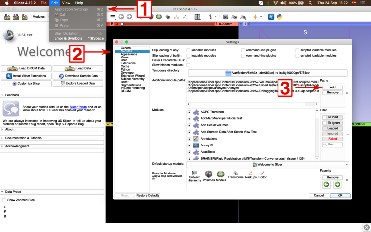
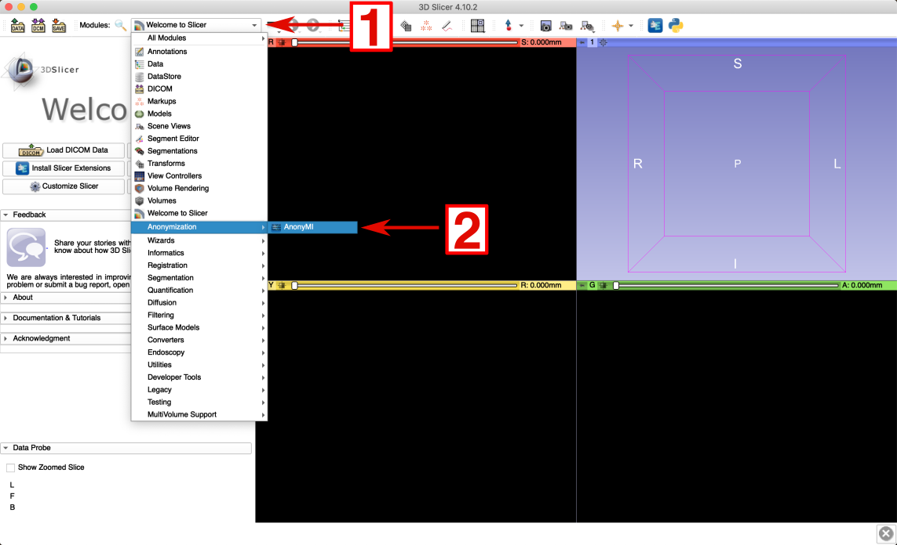
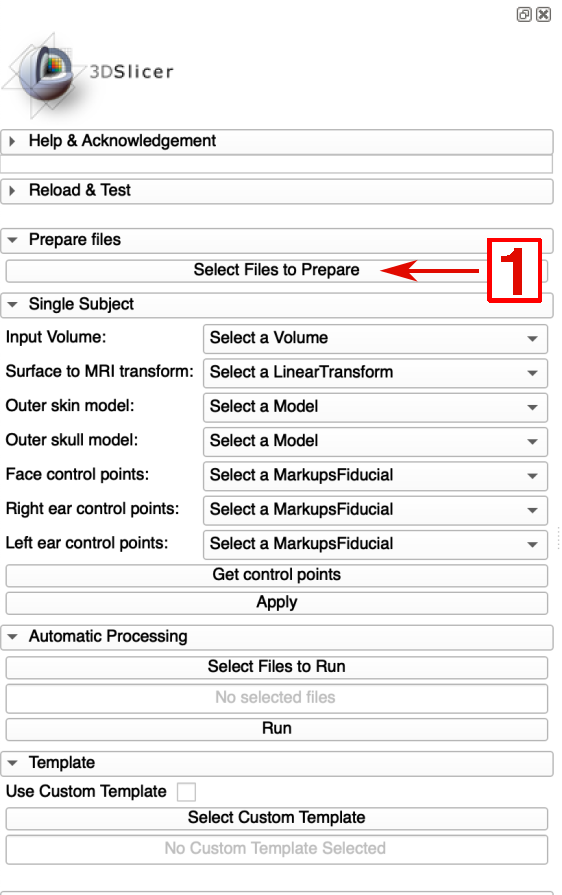
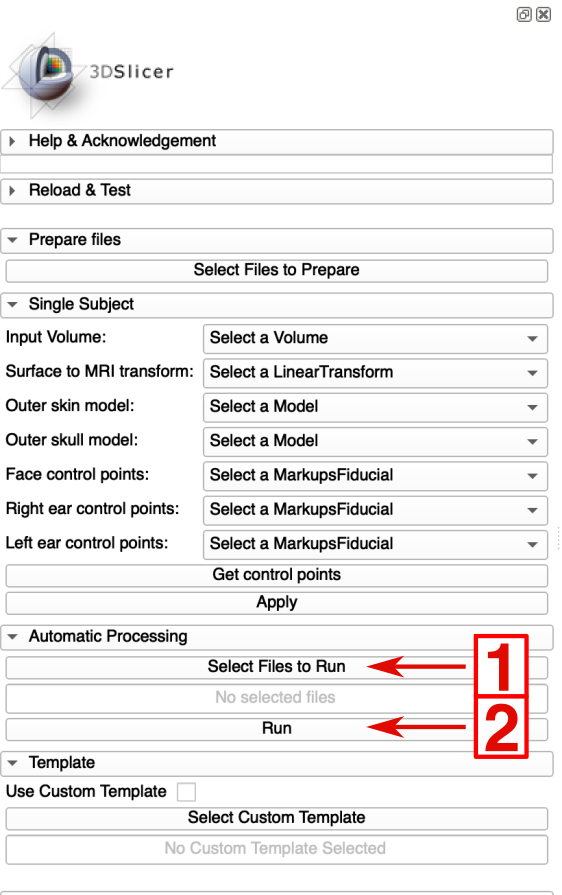
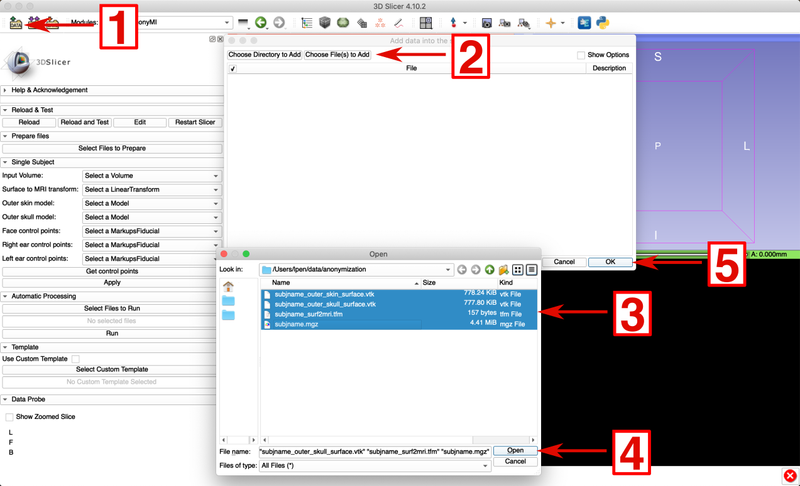
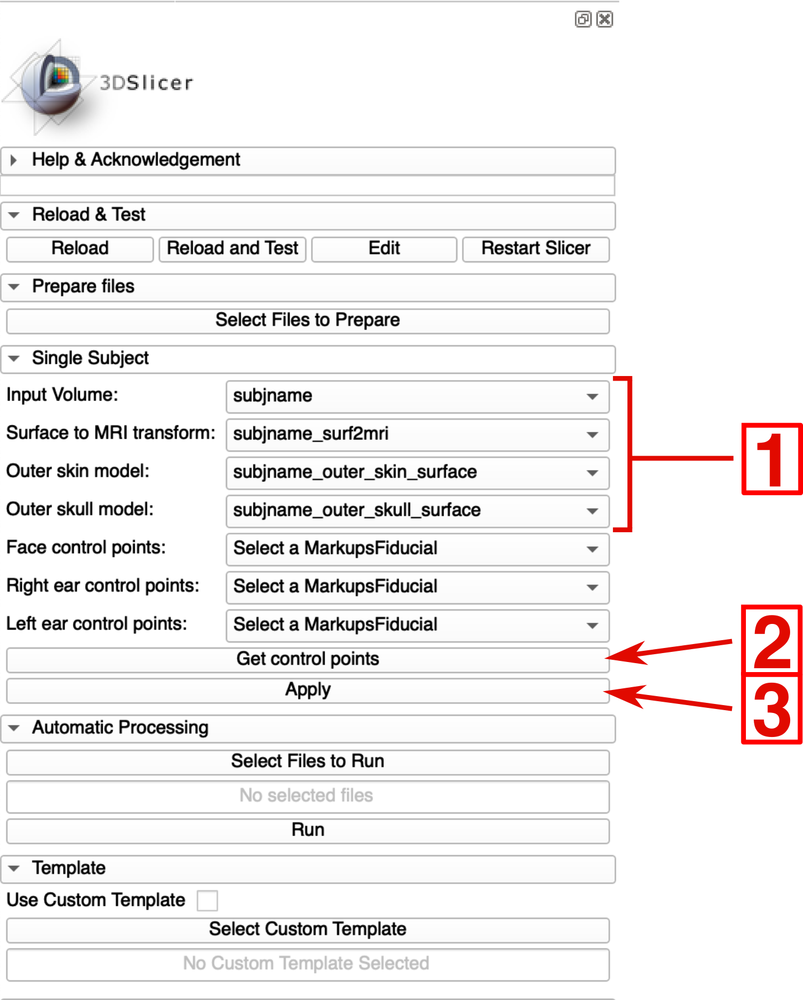
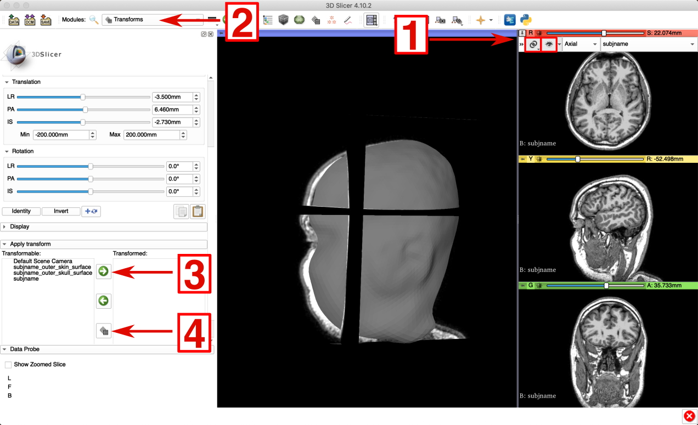
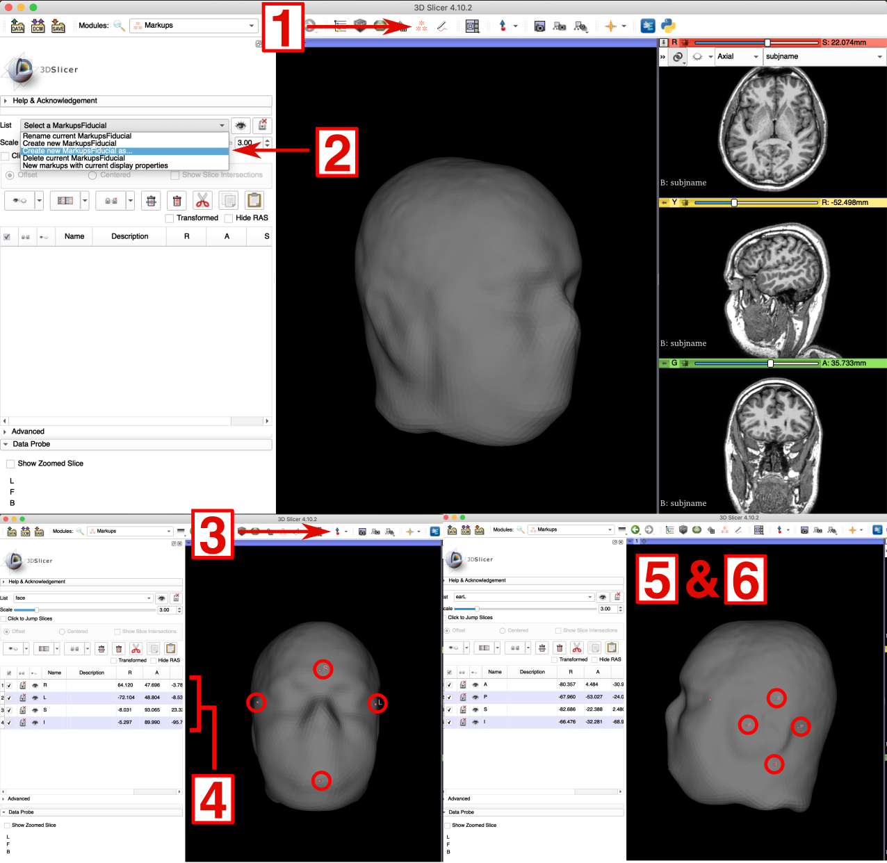
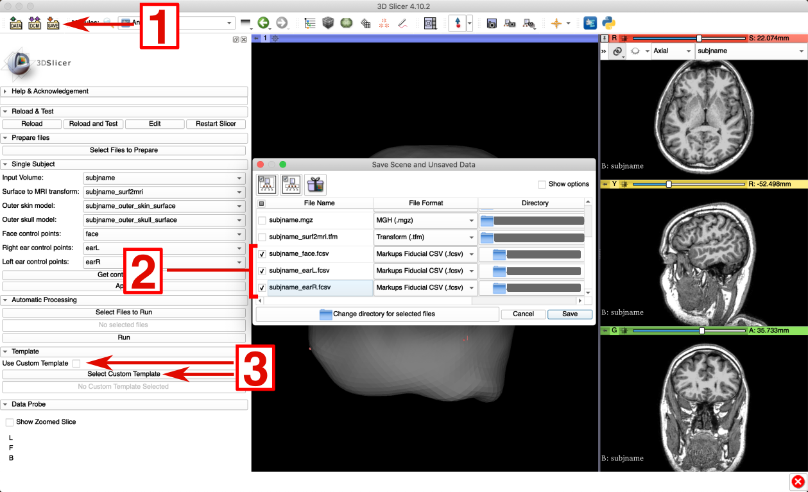
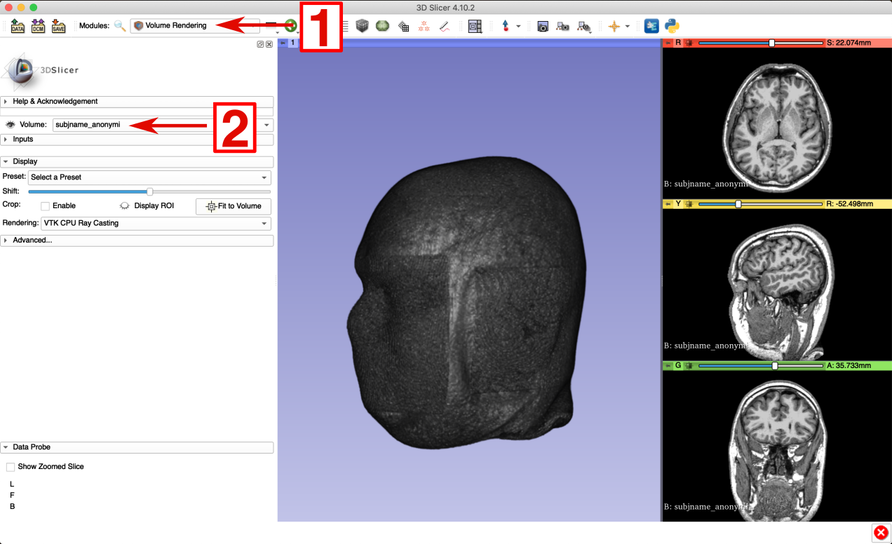

# Anony-MI

Anony-Mi is a tool for anonymizing MRIs which preserves the subject's anatomical geometry. It works as a 3D Slicer Extension and can also be used as a standalone command line script.

[Add Figure 1 after publication]

For a detailed explanation of the procedure please refer to [add publication].

<br/>

## Installation

### Downloading

In order to download Anony-MI clone or download the repository [add repository link]:

Download the .zip using the _Code_ button from on GitHub and place the file in your computer on a folder of your choosing and unzip it. Or, if you are a git user, open a terminal, go to the folder you want to install download the software and run:

```
git clone (add final link)
```


### Requirements

It requires 3D Slicer (with two extra plug-ins). In order to install [3D Slicer](https://www.slicer.org/) please refer to their to their website. After it is installed, open 3D Slicer and go to the Extensions Manager (View > Extensions Manager). In the "Install Extensions" tab search for the VolumeClip and the SlicerElastix extensions and install them.

AnonyMI uses some [Freesurfer](https://surfer.nmr.mgh.harvard.edu/) functions that are already included in it, but require a Freesurfer license to be used. Obtaining a Freesurfer license es free and fast. Fill this [form](https://surfer.nmr.mgh.harvard.edu/registration.html) and you will receive the license via e-mail. Copy the indicated text and put it in a text file inside the Resources folder of AnonyMI once you have downloaded it. If you already have a freesurfer's license, just copy the file.

```shell
.
├── Anonymi
│   ├── Anonymi.py
│   ├── Anonymi.pyc
│   ├── CMakeLists.txt
│   ├── Resources  <------------------- INTO THIS FOLDER
│   │   ├── Icons
│   │   ├── anonymi_cli.py
│   │   ├── average
│   │   ├── bin
│   │   ├── imgs
│   │   ├── lib
│   │   ├── license.txt  <------------- HERE
│   │   ├── run_anonymi.py
│   │   ├── shell
│   │   └── templates
│   └── Testing
│       ├── CMakeLists.txt
│       └── Python
├── Anonymi.png
├── CMakeLists.txt
└── README.md
```

<br/>

### Adding the plug-in

Once you have downloaded it, open 3D Slicer, go to Settings (Edit > Application Settings) and in the Modules tab click on the Add button next to the Additional module paths section. Finally, add the AnonyMI folder. This step has to be done only once.


<p align="center">
  
</p>


<br/>

## Usage

AnonyMI can be used either automatically or manually. Automatic operation will perform the whole process with very few clicks. It is the fastest way of performing the anonymization procedure. Manual operation allows for precise fine-tuning of the areas to be anonymized, which can be useful for particularly difficult cases.

In both cases the procedure is divided in two steps. 1) Preparing the files (~10 minutes) and 2) Running the algorithm (~1 minute).

To open AnonyMI's interface go to the Modules menu in Slicer and under Anonymization you will find AnonyMI.

<p align="center">
  
</p>

<br/>

### Preparing the files

This involves several steps that are executed automatically and in sequence by choosing one or more MRI files.

Press the _Prepare Files_ button, navigate to the folder where you have your MRIs and choose one or more MRI files. If you choose multiple files their preparation will be performed in sequence. It is advisable to copy all the MRIs you want to anonymize on one folder, this way, selecting the files will be faster and you will always have a back-up.

<p align="center">
  
</p>

<br/>

### Automatic Mode

To automatically anonymize one or more MRIs follow these steps

1. Press the button _Select files to Run_ in the Automatic Processing section, navigate to the folder where the MRIs are located and choose the files corresponding to the subject or subjects you want to process. The possible files to be selected will be highlighted (you only need to select the files ending in _outer_skin_surface.vtk_).
2. Press the _Run_ button on the Automatic Processing section.

<p align="center">
  
</p>


### Manual Mode

To run the anonymization in manual mode follow these steps.

1. Load the files that have been prepared for the subject you want to anonymize (see Preparing Files above) using Slicer's interface:

<p align="center">
  
</p>

1. Select the appropriate files on the _Input Volume_, _Surface to MRI transform_, _Outer skin model_, _Outer skull model_.
2. At this point AnonyMI can identify the face and ears areas by itself or you can indicate them yourself (see below for the latter procedure). To find the face and ears areas press the _Get control points_ button as shown above.
3. After the control points gave been found, check that the _Face control points_, _Right ear control points_ and _Left ear control points_ field are propertly set with their corresponding control points and press _Apply_.

<p align="center">
  
</p>


After it finishes you will be able to see the anonymized MRI and also to create a 3D render of it to observe the results (see below).

<br/>

#### Manual control points

In the example above the control points used for finding the portions to be masked were automatically determined. However, in some cases it is preferable to set them manually, for example if there are certain non-standard areas that would need to be masked, or if the template doesn't match the subject well. 

In order to manually assign the control points:

1. First you will have to align the MRI with the 3D reconstructions using one of the files created by AnonyMI. In any of the MRI panels go tho the pin icon and select the link and the view options as shown below. You can check the alignment in the 3D panel. Then go to the _Transforms_ module, select the _outer_skin_ and _outer_skull_ surfaces and click the right pointing arrow to apply add them to the to-be transformed list. Make sure that the active transform in the _Transforms_ panel is the one corresponding to the subject you are processing. Finally select the two surfaces you just moved right and click the _Harden transform_ button (this will apply the transform and bring the two surfaces back to the left) as shown below.

   <p align="center">
     
   </p>

2. Go to the _Markups_ module. Click on _Create e new MarkupsFiducial as..._ and name it __face__. Using the _Create-and-place Fiducial_ tool mark the points that define the area the you want to cover. Name this points S (for Superior), I (for Inferior), R (for Right) and L (for Left). Then repeat the process to create a new List named __earL__ for the left ear and __earR__ for the right ear. For the ears name the points (A for Anterior), P (for Posterior), S (for Superior) and I (for Inferior).

   <p align="center">
     
   </p>

3. Select the created fiducials in the control points fields of the AnonyMI module and press Run.

<br/>

#### Group Specific Templates

To create a custom template:

1. Run the _Prepare Files_ process on the MRI that you want to use as a template as explained above.

2. Manually mark the control points as explained above.

3. Save the control points using Slicer's interface naming the according to the following convention

   (Add image)


To run the process, either manually or automatically:

1. Mark the _Use Custom Template_ box in the Template section

2. Press the _Select Custom Template_ button in the Template section and select the MRI you want to use.

3. Run the anonymization process either manually or automatically as explained above.

   <p align="center">
     
   </p>

<br/>

#### 3D Rendering of Results

To create a 3D render of the anoymized MRI:

1. Open the Volume Rendering module on the modules section.
2. Select the anonymized Volume (or the original MRI if you want to compare them)
3. Click the eye symbol.

The render will appear on the 3D View panel.

<p align="center">
  
</p>


#### Troubleshooting

AnonyMI produces two types of logs. On one hand, a direct log can be viewed by opening the Python Console in 3DSlicer. On the other hand, the output the Freesurfer's functions used by AnonyMI can be found in a _.txt_ log file that is saved in the same folder as the input MRI.

If you are on a Mac computer and you can't use AnonyMI because it says that it is from an unidentified developer you can solve it by finding the Slicer application (usually in the Applications folder), holding _ctrl_ while clicking it, and selecting _open_. The explanation and the aforementioned solution can be found in the official Apple's [help page](https://support.apple.com/en-gb/guide/mac-help/mh40616/mac).

It is also possible to find another permissions problem on Mac computers when trying to run the _Prepare Files_ part o AnonyMI. If you find that you can't run the Freesurfer commands required for this, you can go to the _Resources -> bin_ -> _mac_ or _Resources -> lib -> gcc_ folder of AnonyMI and then double click on the command that you are unable to run (e.g. _mri_watershed_) and then going to System Preferences -> Security & Privacy and allowing the execution from there (the window will show the last blocked command). If needed you will have to repeat the operation for each of the commands that are being blocked. 

On Linux it is possible to to find a "Permission denied" error. To solve this go to the the folder _AnonyMI_ -> _Resources_ -> _bin_ -> _linux_, right-click on each one of the files, open _Properties_, go to the _Permissions_ tab and set "Allow executing file as program" option. You can also do this from a Terminal by going to that same folder and running:    

```bash
chmod 755 *
```


If you find any other problem or difficulty please open an issue on our GitHub repository [add link]. Please submit the error logs (see above) when posting issues. If you would like to contribute please join us on GitHub.

